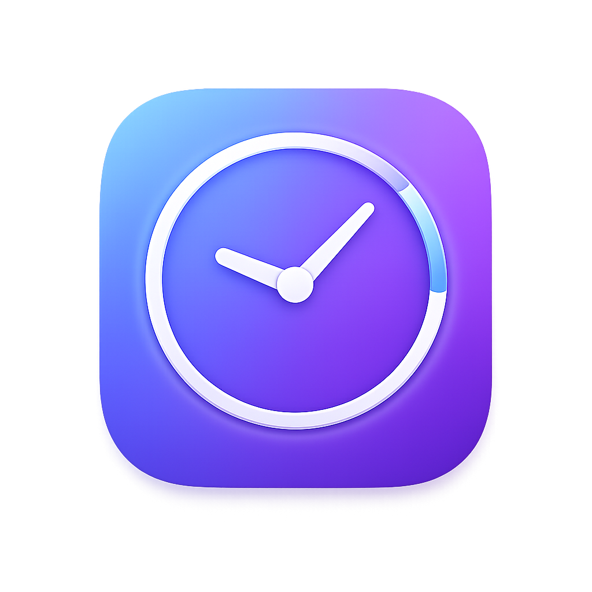
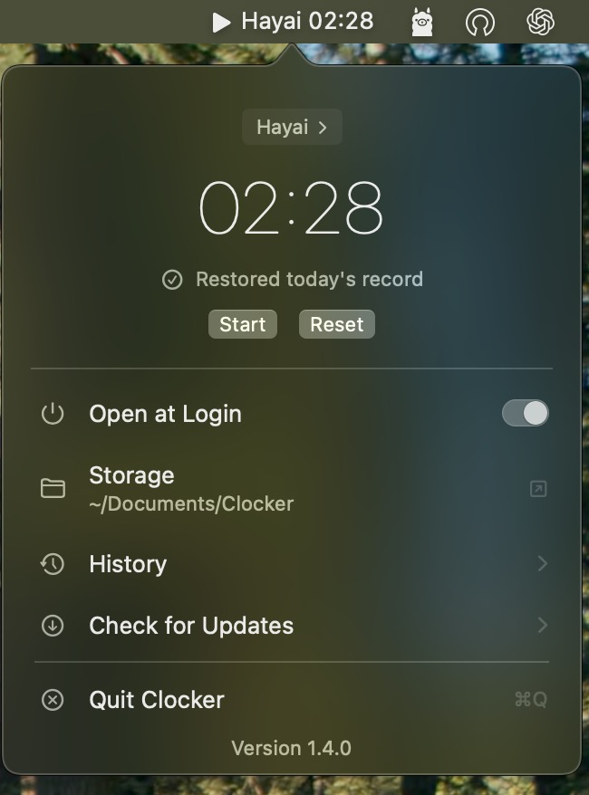

<p align="center">
  
</p>

# Clocker

Clocker is a lightweight, native macOS menu bar app for tracking how much time you spend working each day. It lives in your menu bar, stays out of the way, and writes plain-text daily logs to your local file system — no accounts, no cloud, no fuss.

Built with SwiftUI and AppKit. Requires macOS 13+.


---

## Preview

<p align="center">
  
</p>

The screenshot above shows the current popover layout, including the running timer, project selector, restore state, storage shortcut, history entry point, and login toggle.

## Features

- **Menu bar timer** — displays a live `MM:SS` (or `H:MM:SS`) stopwatch directly in the macOS menu bar with play/pause icon
- **One-click control** — left-click the menu bar icon to start/stop the timer; right-click (or ctrl-click) to open the popover
- **Project tracking** — create named projects, switch between them, and track time per project independently
- **Daily persistence** — each second is appended to a dated `.txt` file so your progress is never lost, even if the app crashes
- **Auto-restore** — on launch, Clocker reads today's log file and restores the elapsed time for the active project
- **History view** — browse all recorded days grouped by project, with file size and modification date
- **History status** — mark any history day as done or not done with a green/red badge
- **Open at Login** — toggle launch-at-login via `SMAppService` (no helper app needed)
- **Automatic updates** — GitHub Releases integration via AppUpdater for signed release builds
- **Open storage folder** — quick access to your time logs from the popover menu
- **Reset** — clear today's timer and delete the day's record for the active project
- **Themed UI** — consistent design system with hover states, smooth animations, and a compact popover layout

## How It Works

Clocker runs as a menu bar-only app (no Dock icon, no main window). The `AppDelegate` creates an `NSStatusItem` and wires it to an `NSPopover` containing the SwiftUI view hierarchy.

### Timer

`ClockModel` drives the stopwatch using a Combine `Timer.publish` that fires every second. Each tick:

1. Increments the elapsed seconds counter
2. Updates the formatted display string (`MM:SS` or `H:MM:SS`)
3. Appends the current time to today's log file via `TimeWriter`

### Storage

All data lives under `~/Documents/Clocker` (release) or `~/Documents/Clocker-Dev` (debug / `.dev` bundle ID).

```
~/Documents/Clocker/
├── 2026-03-31.txt          ← default project ("Inbox") daily log
├── .2026-03-31.txt.status.json  ← hidden done/undone status for the day
├── projects.json           ← project definitions
├── state.json              ← active project ID
└── <project-uuid>/
    └── 2026-03-31.txt      ← per-project daily log
```

Each `.txt` file contains one line per second with the running total:

```
00:01
00:02
00:03
...
12:34
```

On restore, Clocker reads the last line of today's file to recover the elapsed time.

History status is stored in a hidden JSON sidecar next to each daily log so the timer format stays unchanged.

### Projects

Projects are stored in `projects.json` as an array of `ClockProject` objects. Each project has an `id`, `name`, and optional `lastUsedAt` timestamp. The default project is called "Inbox" and stores its logs in the root storage folder. Custom projects store logs in subdirectories named by their UUID.

`ProjectStore` handles loading, saving, and ordering projects. `state.json` tracks which project is currently active.

## Project Structure

```
Clocker/
├── ClockerApp.swift                 # @main entry point
├── Support/
│   └── AppDelegate.swift            # NSStatusItem, NSPopover, click handling
├── Models/
│   ├── ClockModel.swift             # Timer state, project switching, restore logic
│   └── ClockProject.swift           # Project data model
├── Services/
│   ├── TimeWriter.swift             # Background file I/O on a serial queue
│   ├── ProjectStore.swift           # Project list and active state persistence
│   ├── LoginItemService.swift       # SMAppService wrapper for launch-at-login
│   └── AppUpdateService.swift       # AppUpdater wrapper for GitHub Releases updates
└── UI/
    ├── MenuBarPopover.swift          # Page navigation (main / history / projects)
    ├── MainMenuPage.swift            # Timer display, start/stop/reset, menu items
    ├── HistoryPage.swift             # Browsable list of daily log files by project
    ├── ProjectsPage.swift            # Project list with create, rename, delete, switch
    ├── Theme.swift                   # Centralized spacing, sizing, fonts, colors
    └── MenuRowButtonStyle.swift      # Reusable hover/press button style
```

## Getting Started

### Prerequisites

- macOS 13 Ventura or later
- Xcode 15+

### Build & Run

1. Open `Clocker.xcodeproj` in Xcode
2. Select the `Clocker` scheme and a macOS destination
3. Build and run (⌘R)
4. Look for the play icon in your menu bar

### Command-Line Build

```bash
xcodebuild -project Clocker.xcodeproj -scheme Clocker -configuration Debug build CODE_SIGNING_ALLOWED=NO
```

## Usage

| Action                  | How                                                              |
| ----------------------- | ---------------------------------------------------------------- |
| Start / stop timer      | Left-click the menu bar icon                                     |
| Open popover            | Right-click or ctrl-click the menu bar icon                      |
| Reset today's timer     | Click "Reset" in the popover (visible when stopped and time > 0) |
| Switch project          | Click the project name at the top of the popover                 |
| Create a project        | Go to Projects page → type a name → press Enter or click +       |
| Rename / delete project | Go to Projects page → click "Edit"                               |
| View history            | Click "History" in the popover                                   |
| Open storage folder     | Click "Storage" in the popover                                   |
| Toggle open at login    | Use the toggle in the popover                                    |
| Quit                    | Click "Quit Clocker" or press ⌘Q                                 |

## Architecture Notes

- **No Dock icon** — the app uses `Settings { EmptyView() }` as its only scene, keeping it menu bar-only
- **Thread safety** — `TimeWriter` performs all file I/O on a dedicated serial `DispatchQueue`; `ClockModel` is `@MainActor`-safe via callbacks
- **Restore feedback** — a brief delay before showing the "Restoring" spinner avoids flicker on fast restores
- **Project ordering** — active project first, then by most recently used, then alphabetical
- **Menu bar title** — project names longer than 8 characters are truncated with an ellipsis to keep the menu bar compact

## Releases & Updates

- AppUpdater checks GitHub Releases for the `adamward459/clocker` repository
- Release assets must be named with the app prefix and semantic version, for example `Clocker-1.3.0.zip`
- Release builds must be signed and notarized so AppUpdater can validate the downloaded bundle before installation
- Clocker is intentionally kept non-sandboxed, which matches AppUpdater's current requirements
- The updater normalizes GitHub `v1.0.0` release tags and matching asset names at runtime, so existing `v`-prefixed release conventions still work
- The update flow is available from the popover as "Check for Updates"

## Testing

```bash
xcodebuild -project Clocker.xcodeproj -scheme Clocker test CODE_SIGNING_ALLOWED=NO
```

Test files live in `ClockerTests/`.

## License

No license file is currently included in the repository.
